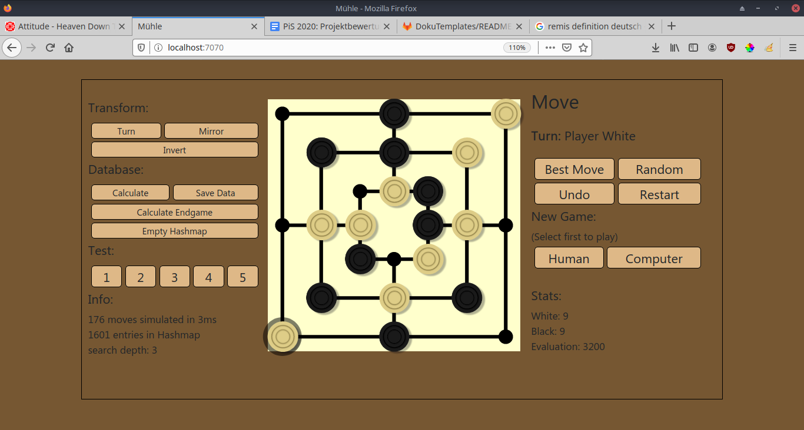

# Mühle (PiS, SoSe 2020)

This app is currently not online. To test it locally run 'gradle run' inside the root directory. The app listens on port 7070. 
Die App ist derzeit nicht online. Sie kann mit Ausführen von 'gradle run' innerhalb des Projektverzeichnisses getestet werden. Die App auf Port 7070 erreichbar.

Autor: Benedikt Jensen, 5302211

Ich habe die Zulassung für PiS im SoSe 2020 bei Herrn Herzberg erhalten.

1. [Einleitung](#introduction)
2. [Spielregeln](#rules)
3. [Bedienungsanleitung](#manual)
4. [Dateiübersicht](#overview)
5. [Spiel-Engine](#engine)
6. [Tests](#tests)
7. [Umsetzung der GUI](#gui)
8. [Optionale Hinweise und Quellenangaben](#info)

## Einleitung 

### Spielregeln 

Weiß spielt traditionell immer zuerst. In der ersten Spielphase wird abwechselnd je ein Spielstein auf ein freies Feld 
gesetzt, bis insgesamt je 9 Spielsteine eingesetzt wurden. 
In der nächsten Phase wird stattdessen je Zug ein eigener Spielstein auf
ein angrenzendes freies Feld bewegt. Wenn zu irgendeinem Zeitpunkt im Spielsteine eine Dreierreihe, genannt eine Mühle, 
bilden, kann der Spieler, welcher diese Reihe gebildet hat, einen Spielstein des Gegners aus dem Spiel nehmen. Dabei ist 
es nicht erlaubt einen Stein aus einer Mühle zu nehmen. Befindet sich allerdings jeder der gegnerischen Spielsteine in
einer Mühle, wird diese Regel ungültig und der zu nehmende Spielstein darf frei gewählt werden. 
Sobald ein Spieler nur noch drei Spielsteine auf dem Feld hat, ist es ihm erlaubt mit seinen Spielsteinen auf ein 
beliebiges freies Feld zu springen, anstatt nur auf angrenzende Felder zu ziehen. 

Das Spiel endet, wenn einem Spieler 
entweder kein gültiger Zug mehr möglich ist, oder er weniger als drei Spielsteine übrig hat. 
Der jeweilige Spieler verliert das Spiel. 
Remis: Das Spiel endet auch, wenn dreimal hintereinander, die gleiche Abfolge von Spielzügen gemacht hat, oder
wenn 20 Spielzüge gemacht wurden, ohne das sich eine Mühle gebildet hat. In beiden Fällen endet das Spiel mit 
unentschieden.

### Bedienungsanleitung 

Das Spiel wird ausschließlich mit der Maus gesteuert. Durch Anklicken eines Spielsteins, wird dieser angewählt. Durch
Klicken auf ein Spielfeld, wird der gewählte Spielstein auf dieses Feld gezogen, soweit gültig. Eingesetzt werden 
Spielsteine durch Klicken auf ein freies Feld. Genommen werden Spielsteine durch Anklicken des jeweiligen Spielsteins.

#### Rechtes Menü (für Nutzer):

Ganz oben rechts steht einerseits die fällige Aktion und andererseits welche Farbe am Zug ist.

##### Spielzug-Buttons:
- Best Move: Berechnet und spielt den bestmöglichen Zug des aktuellen Spielers
- Random: Macht einen zufälligen Zug
- Undo: Macht den Spielverlauf bis einschließlich des letzen Zugs des menschlichen Spielers rückgangig.

##### Unter New Game lässt sich ein neues Spiel starten: 
- Human: Startet ein Spiel mit dem Menschen als Startspieler
- Computer: Startet ein Spiel mit dem Computer als Startspieler
- HumanVsHuman: Startet ein Spiel mit zwei menschlichen Spielern

Bei Standardeinstellungen beginnt der menschliche Spieler. Wenn der Computerspieler an der Reihe ist, macht er seinen
Zug automatisch.

##### Unter Stats lassen sich Informationen zum Spiel herausfinden:
- Anzahl an weißen Spielsteinen
- Anzahl an schwarzen Spielsteinen
- Evaluation der momentanen Spielsituation anhand von Kriterien

#### Linkes Menü: (für Entwickler)

Hier lassen sich diverse Einstellungen zur Spiele-Engine machen

##### Transform:
- Turn: Dreht das Spielfeld um 90° im Uhrzeigersinn
- Mirror: Spiegelt das Spielfeld an der Vertikalen
- Invert: Vertauscht inneren und äußeren Spielbrettring

##### Database:
- Calculate: Berechnet von der momentanen Situation ausgehend zufällige Züge und speichert sie in der Hashmap
- Save Date: Speichert alle Hashmap-Einträge als Textdatei
- Calculate Endgame: Berechnet die Endspieldatenbank, also Bewertungen für alle Positionen mit jeweils 3 Spielsteinen
jeder Farbe im Spiel
- Empty Hashmap: Löscht alle Einträge aus der Hashmap(nützlich um "bestMove()" mit spezifizierten Einstellungen zu testen)

##### Test:
- 1,2,3,4,5: Führt den jeweiligen Test aus
- Stellenbewertung: Kriterien/MonteCarlo: Wechselt zwischen Stellenbewertung anhand von Kriterien oder Monte-Carlo-Methode

##### Info:
- Details zur "bestMove()" Berechnung
- Anzahl an Einträgen in der Hashmap
- Suchtiefe des Alphabeta-Algorithmus (kann eingetragen werden)
- Zeitlimit des Alphabeta-Algorithmus (kann eingetragen werden)

#### Konsolenausgabe:
In der Konsole wird nach jedem Zug eine Statistik zur Spielsituation inklusive einer Repräsentation des Spielfelds ausgegeben. Wird ein Test gestartet wird außerdem
der zu wählende Zug angezeigt. Die Variable displayAlphaBetaEval im companion objet der Klasse Muehle, kann auf true
gesetzt werden, um zusätzlich die Bewertung jedes Zuges bei Benutzung von "bestMove()" anzuzeigen.

### Dateiübersicht 

    \build.gradle
    \README.md
    \Screenshot.png
    \src\main\kotlin\muehle\App.kt
    \src\main\kotlin\muehle\Muehle.kt
    \src\main\kotlin\muehle\MuehleInterface.kt
    \src\main\resources\public\index.html
    \src\main\resources\public\database.txt
    \src\main\resources\public\databasePermanent.txt
    \src\main\resources\public\databaseTest5.txt
    \src\main\resources\public\script.js
    \src\main\resources\public\images\ -> svg-files

    -------------------------------------------------------------------------------
    Language                     files          blank        comment           code
    -------------------------------------------------------------------------------
    Kotlin                           4            119            190            662
    HTML                             1              8              2            155
    Markdown                         1             68              0            155
    JavaScript                       1             10              7             70
    Gradle                           1             11             16             18
    -------------------------------------------------------------------------------
    SUM:                             8            216            215           1060
    -------------------------------------------------------------------------------
    (SVG-Dateien wurden ignoriert)

## Spiel-Engine (ENG) 

Feature    | AB  | H+S |K(MC)| eD  | B+I  | Summe
-----------|-----|-----|-----|-----|------|----
Umsetzung  | 120 | 100 | 100 | 130 | 66.6 |
Gewichtung | 0.4 | 0.3 | 0.3 | 0.3 |  0.3 | 
Ergebnis   |  48 |  30 |  30 |  39 |   20 | **167%**

Meine Implementierung des Spiels Mühle mit KI benutzt den Alphabeta-Algorithmus in Kombination mit Stellenbewertung anhand
von Kriterien oder wahlweise anhand der Monte-Carlo-Methode. Diese lässt sich im Menü aktivieren, führt aber zu längeren
Rechenzeiten. 

##### Klasse Muehle:
Die Klasse Muehle enthält die gesamte Spiel-Engine. Hier werden Züge berechnet, gespielt und zu Spielstellungen werden 
Stringrepräsentation gemacht. Die Klasse implementiert das Interface MuehleInterface. Ihre Parameter sind:
- nodes: IntArray zweier Integerwerte, welche jeweils die Positionen der Spielsteine beider Spieler enthält.
- sel: Die aktuelle Auswahl
- turn: Der aktive Spieler
- avl: Insgesamt noch einzusetzende Spielsteine
- phs: Die fällige Spielaktion(Insert/Move/Take = 1/0/-1)
- last: Die unmittelbar vergangene Spielstellung. Existiert keine, so ist last = null

Für jede Spielaktion wird eines neues Objekt der Klasse Muehle erstellt. Das companion object enthält bleibende Variablen.
"paths" ist ein Array von Maps, welche jedes von jedem Feld aus jeweils erreichbare Feld beschreibt. Dies dient zur
Berechnung valider Züge.

##### Klasse App:
Die http-Requests werden in der Klasse App verarbeitet. Hier befindet sich auch der Programmeinstieg, die Variable "m"
welche eine Referenz auf das aktuelle Muehle Objekt ist wird erstellt, und Testszenarien werden definiert.

##### Alphabeta-Algorithmus:
Dieser Algorithmus ist der Kern der Mühle KI. Er bewertet eine Spielposition durch Simulieren der kommenden Züge unter
der Annahme, dass der Gegner immer den besten Zug macht. Der Unterschied zum Minimax Algorithmus ist,
dass er irrelevante Abzweigungen im Spielbaum kappt und somit schnellere Berechnungsergebnisse liefert. Der Algorithmus
orientiert sich am auf Wikipedia verfügbaren Pseudocode dazu. Die Suchtiefe des Algorithmus ist als Standard auf 3 gesetzt.
Zusätzlich gibt es ein Zeitlimit von 3000ms, nach wessen Überschreitung die Berechnung vorzeitig beendet wird. 
Weiß ist der maximierende Spieler, Schwarz der minimierende. Erreicht der Alphabeta-Algorithmus das Spielende, so wird die
Stellenbewertung mit der verbleibenden Suchtiefe+1 (1 + maxDepth - depth) multipliziert. Dies garantiert, dass immer der
schnellste Weg zum Sieg bzw. das längste Hinauszögern der Niederlage gewählt wird.

##### Stellenbewertung anhand von Kriterien:
Die Stellenbewertung geschieht durch Zählen der verfügbaren Spielsteine und Einser- und Zweierreihen, welche noch nicht
blockiert wurden. Ein Game Over wird mit 100 000 Punkten für den Sieger bewertet. Jeder eigene Spielstein gewichtet 10 000
Punkte. Jede Einserreihe ist 1 000 Punkte Wert. Eine Zweierreihe ist 3 000 Punkte Wert, wenn es sich um den aktiven Spieler
handelt. Für den inaktiven Spieler ist sie nur 2 000 Punkte Wert. Das liegt daran, dass der Spieler, welcher zuerst eine
Mühle schließt, den Gegenspieler davon abhalten kann, seine eigene Mühle zu bilden. 
Die Summe all dieser Punkte, wobei für Schwarz immer der negative Gegenwert genommen wird, ergeben die Evaluation der
Spielstellung.

##### Monte-Carlo-Methode: 
Von der zu bewertenden Spielposition ausgehend, wird mit einer festen Anzahl von Wiederholungen ein
komplett zufälliges Spiel bis zu einer bestimmten maximalen Anzahl an Zügen durchgeführt. Endet das zufällige Spiel mit
einem Sieg, ist die Bewertung 100000. Endet sie mit einer Niederlage, so ist die Bewertung -100000. Unentschieden wird
mit 0 bewertet. Die endgültige Bewertung der Spielposition ergibt sich, indem man die Bewertung aller Wiederholungen
summiert und den Mittelwert berechnet. Gegen den Monte-Carlo Algorithmus lässt sich am besten auf Sichttiefe 1 oder 2
spielen. Ab Sichttiefe 3 ist die Wartezeit zu lang. (Es handelt sich hier nicht, um die Monte-Carlo-Tree-Search, welche sich auf gut bewertete Spielbaum-Knoten
konzentriert) 
Als Standardeinstellung ist die Monte-Carlo-Methode abgestellt. Sie kann in der GUI eingeschalten werden, in welchem Fall
sie die Stellenbewertung anhand von Kriterien ersetzt.

##### Best Move
Die Funktion "bestMove()" bewertet alle mit eine Zug erreichbaren Spielstellungen. Diese Bewertungen werden um eine relativ
kleine Zahl zufällig verändert, um zu verändern, dass die KI immer auf die selbe Art spielt. Die zufällige Veränderung
geschieht mit der selbst definierten Funktion "noise()". Der maximierende Spieler wählt
die höchste Bewertung, der minimierende Spieler wählt die geringste. "bestMove()" hat den return type Move.

##### Bitboards
Das Programm verwendet Bitboards. Die Positionen der Spielsteine wird durch zwei Integerwerte, einer je Farbe, repräsentiert.
Die ersten 24 Bits jedes Integers sind entweder "0" oder "1", wobei "1" bedeutet, dass ein Spielstein der jeweiligen Farbe
an der jeweiligen Stelle liegt. 
Diese Datenstruktur ermöglicht effiziente Berechnungen für z.B. die Stellenbewertung. Dazu werden bitweise logische Verknüpfungen
der Positionsvariablen mit sich selbst, um bestimmte Stellen versetzt, und mit Filtern genutzt.

##### Hashing
Nach Bewertung einer Spielstellung mit Alphabeta, wird das Ergebnis in der Hashmap "hm" gespeichert. Berechnungen die mit
aktivem Spieler Schwarz geschehen sind (bei welchen negative Werte guten Spielstellungen entsprechen) wird der Wert invertiert.
Beim Auslesen der Bewertung wird dieses Invertieren gegebenenfalls rückgängig gemacht. Diese Anpassung des Werts macht es
möglich, dass das Vertauschen der Farben keine zusätzlichen Bewertungen braucht. Zwei verschiedene Stellungen, welche sich
einzig durch vertauschte Farben unterscheiden, werden als gleichwertig behandelt. Das ermöglicht fast eine Halbierung des
benötigten Speichers. Als Datentyp des Hashkeys wir Long verwendet.

Der Hashcode ergibt sich wie folgt:

    "11 ungenutzte Bits" + "die Anzahl der noch zu setzenden Spielsteine" + "die ersten 24 Bit der Positionsvariable des Gegners" + "die ersten 24 Bit der eigenen Positionsvariable" 
    0 0 0 0 0 0 0 0 0 0 0 0 1 0 0 1 0 0 0 0 0 0 0 0 0 0 0 0 0 0 0 0 0 0 0 1 1 1 0 1 0 0 0 0 0 0 0 0 0 0 0 0 0 0 0 0 0 0 1 0 0 1 1 0
           ungenutzt     | avl = 9 |            opponent's tokens                  |                 own tokens

Da immer zuerst die gegnerischen Spielsteine genannt werden, ist es egal für welche Farbe die Bewertung eingespeichert wird.
Sei es Weiß oder Schwarz, der aktive Spieler steht immer rechts. "Symmetrische" Spielsituationen müssen also nur einmal gespeichert werden.

Es werden auch geometrische Symmetrien beachtet. Dabei wird Drehung, Spiegelung und Invertierung(Vertauschen des inneren und
äußeren Spielbrettrings) beachtet. Insgesamt ergibt sich eine Verringerung der resultierenden Ergebnisse um den Faktor 16
zuzüglich der Symmetrie durch verschiedene Spielfarben, also eine insgesamte Verringerung um ca. den Faktor 32.

##### Datenbank
Die vorhandene Datenbank "databasePermanent.txt" beinhaltet nur das Ende des Spiels. Wenn beide Spieler nur noch drei
Spielsteine haben, ergeben sich die meisten Zugmöglichkeiten, da Springen erlaubt ist. Dadurch kann sich die Berechnung
in die Länge ziehen. Das verhindert die Datenbank. Die Datenbank wurde mit der selbst definierten Funktion "endgame()" erstellt. 
Zusätzlich zur Endspieldatenbank wird eine temporäre Datenbank "databaseTemporary.txt" erstellt. Diese dient allein Test-, und
Veranschaulichungszwecken. Die temporäre Datenbank lässt sich über die GUI überschreiben. 
Für Test 5 gibt es eine eigene Datenbank, welche nur die für den Test gebrauchten Daten enthält.

##### Interface
Im Interface MuehleInterface sind die wichtigsten Funktionen aufgelistet.

## Tests (TST) 

Szenario |  1  |  2  |  3  |  4  |  5  | Summe
---------|-----|-----|-----|-----|-----|-------
ok       |  X  |  X  |  X  |  X  |  X  | 1.0

Die Tests werden wie folgt ausgeführt:

Auf der linken Seite der GUI befinden sich diverse Buttons und Infos zum Programm. Unter Test lässt sich eine Nummer von
1 bis 5 aussuchen, welche, gemäß der Angaben nummeriert, den jeweiligen Test starten. Vor Ausführung der Tests wird die
Hashmap automatisch geleert, sodass die Berechnung erneut stattfindet, anstatt dass bestehende Ergebnisse herangezogen
werden.

Folgende Abbildung stellt das Spielfeld mit den nummerierten Feldern dar:

    O--------1--------2
    |  8-----9-----1O |
    |  |  16-17-18 |  |
    7--15-23    19-11-3
    |  |  22-21-20 |  |
    |  14----13----12 |
    6--------5--------4

Spielzüge werden in folgender Form in der Konsole ausgegeben: 
    
    Move: 0 -> 1 (8)
    
Das Beispiel repräsentiert einen Spielzug, bei welchem ein eigener Spielstein von Feld 0 auf Feld 1 gesetzt wird und
ein gegnerischer Spielstein von Feld 8 aus dem Spiel genommen wird. Es ist anzumerken, dass die Standardeinstellung für
die Sichttiefe des Alphabeta-Algorithmus 3 ist. Für die Tests wird sie jedoch auf die jeweils notwendige Tiefe gesetzt. 
Es folgt eine Schilderung der 5 verfügbaren Tests.

- Test 1: Spieler schwarz spielt den Gewinnzug, indem er einen eigenen Spielstein auf Feld 2 zieht. (Tiefe 1)
- Test 2: Spieler schwarz sichert sich den Sieg im übernächsten Zug durch Bilden von 2 Zweierreihen. Weiß kann im
Folgezug nur eine davon blockieren. (Tiefe 3)
- Test 3: Spieler schwarz ist am Zug. Keiner der Spieler hat eine Zweierreihe. Durch geschickte Spielzüge erlangt
schwarz erst zwei Zweierreihen und spielt dann den Gewinnzug. Entscheidend um den Sieg im überübernächsten Zug zu ermöglichen
ist, dass im nächsten Zug zwei Zweierreihen gebildet werden können. Das widerum ist nur dann möglich, wenn in diesem Zug
eine Zweierreihe gebildet wird und außerdem zwei sich überschneidende Einserreihen dabei gebildet werden. Es lässt sich 
überprüfen, dass die KI zuverlässig einen solchen Zug wählt. (Tiefe 5)
- Test 4: Spieler schwarz ist am Zug und verhindert eine unmittelbare Bedrohung durch Spieler weiß, indem er auf Feld
          15 springt. (Tiefe 2)
- Test 5: Spieler schwarz ist am Zug und verhindert eine Niederlage im übernächsten Zug des Gegners. Das ist nur möglich
durch blockieren von Feld 9 oder 10. (Im Test wird immer Feld 10 blockiert. Dass liegt daran, dass obwohl 
Blockieren von Feld 9 die Niederlage verhindert, dieser Spielzug schlechter bewertet wird.) (Tiefe 4)

(Test 3 erfordert eine Sichttiefe von 5. In der Datenbank sind für Endspielsituationen Bewertungen mit Sichttiefe 3
gespeichert. Speziell für den Test liegen allerdings Bewertungen mit Sichttiefe 3 vor. Es liegen allerdings nicht die
Bewertungen aller möglichen Züge zwischen Beginn von Test 3 bis Spielende vor. Die Berechnung war sehr langwierig.)

Die Testausführung protokolliert sich über die Konsole wie folgt:

    - - - - - - - - - Test 1 - - - - - - - - -
    B--------B--------O   active player: -1
    |  O-----W-----O  |   phase: 0
    |  |  O--O--O  |  |   available: 0
    O--O--O     O--O--B   evaluation(criteria):   -15900
    |  |  O--O--O  |  |   rows of 3: 0
    |  O-----O-----O  |   rows of 2: 2
    W--------W--------B   rows of 1: 1
    Calculated Best Move: 1 -> 2 (5)

## Dokumentation der GUI 

## Umsetzung der GUI

Die GUI wurde mit HTML umgesetzt. Das Spielbrett sowie die Spielsteine wurden mit Inkscape erstellt und liegen als 
SVG-Dateien vor. Sie sind per `` in die HTML-Datei eingebunden. Die Selektoren(grauer Schatten unter
ausgewähltem Spielstein) hingegen liegen direkt als svg-Element in der Datei index.html vor. Sie werden per Javascript
mit angepassten Koordinaten ins HTML eingefügt, undzwar 24 Stück - auf jedem Feld einer. Die meiste Zeit über sind sie
unsichtbar. Nur bei Auswahl des Feldes wird der jeweilige Selektor sichtbar. 
Die Selektoren sind wichtig für die Interaktion mit dem Spieler, denn das onclick-Event dient dem Spielen eines Zugs.
Dabei wird ein http-Request verschickt, welches auch die jeweilige Feldnummer mitgibt.  
Auf ähnliche Weise funktionieren auch die Menübuttons und die Eingabe der Suchtiefe. Ein Request wird verschickt und der
laufende Kotlin-Prozess führt die gegebenen Anweisungen aus. Der Javascript-Code sorgt dafür, dass keine 2 http-Requests
auf einmal verschickt werden können. Bis zum Erhalten einer Antwort werden alle Interaktionen gesperrt. 
Bei Erhalten der http-response werden außerdem diverse Teile des HTML verändert. Die Spielsteine werden korrekt platziert
und die verschiedenen Anzeigen werden aktualisiert.

## Optionale Hinweise und Quellenangaben 

## Hinweise

Meine Umsetzung des Alphabeta-Algorithmus liefert bei Suchtiefe > 3 teilweise nicht schnell genug eine Lösung. Deshalb
wird die Suchtiefe als Standard auf 3 gestellt. In der GUI lässt sich die Tiefe frei wählen, doch bei zu hohen zahlen
könnte das Programm hängen bleiben. Um das zu verhindern ist auch eine maximale Rechenzeit einzustellen, nach Ablauf welcher
auch bei unvollendeter Berechnung der vorläufige Best Move zurückgegeben wird. Als Nebenwirkung kann es in diesem Fall zu
schwachen Zügen kommen.

## Quellennachweis

* https://git.thm.de/dhzb87/JbX/-/tree/master/TicTacToe (zum versenden und beantworten von http Requests am Beispiel TicTacToe)
* https://en.wikipedia.org/wiki/Alpha%E2%80%93beta_pruning  
  (Den Pseudocode zum Alphabeta-Algorithmus fast identisch übernommen
  und darauf aufbauend meinen fertigen Algorithmus geschrieben)
* https://www.youtube.com/watch?v=OgO1gpXSUzU&t=27s (zur Monte-Carlo-Methode)
* https://www.youtube.com/watch?v=AyBNnkYrSWY (zur Monte-Carlo-Methode)
* Herzberg Dominikus, BitBoard.Mühle.png: Erklärung zu Bitboars für Mühle auf Slack, 3.Juli 2020
* http://zetcode.com/kotlin/writefile/ (zum Schreiben von txt-Dokumenten in Kotlin)
* https://www.baeldung.com/kotlin-read-file (zum Lesen von txt-Dokumenten in Kotlin)
* http://library.msri.org/books/Book29/files/gasser.pdf (umfassende Erklärung zur KI für Muehle, wurde genutzt, um
sich eine grobe Übersicht zu verschaffen)
